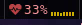

# dwmbcpul - a CPU load module for dwmblocks

Takes recent average load from `/proc/loadavg`, then calculates
frequency percentage for each core separately and outputs everything
in a neatly formatted way.

Polling frequency information on a per-second basis is usually pointless, because
it changes so rapidly that the output is very chaotic and semi-random.
That's why this program reads everything a fixed number of times per second, and
very full second it averages individual cores' frequencies for the output.

The results are stored and updated in a cache file which has to be read directly
by dwmblocks. The update interval is 1 second.

## Status hiding

My dwm and dwmblocks builds add a feature that lets you hide some modules so that
processing power is spared instead of running pointless scripts in the background.
This module supports that feature, read about more details
[here](https://github.com/Randoragon/dwm#status-bar-rewrite) and [here](https://github.com/Randoragon/dwmblocks#persistent-modules).

## Required dwm patches

- [status2d](https://dwm.suckless.org/patches/status2d/)

---

For more information check out my dwm and dwmblocks builds:

- [dwm](https://github.com/randoragon/dwm)
- [dwmblocks](https://github.com/randoragon/dwmblocks)
