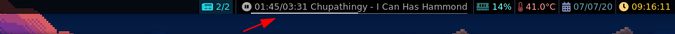

# dwmbmpd - an MPD module for dwmblocks

A super refined status module for MPD, displaying pause/play/stop icons, elapsed time,
duration, artist, title and everything is underlined with a beautiful progress bar.
If either the artist of the title are longer than specified, an ellipsis is put instead.

The bar measurements can be a bit sloppy sometimes, I'm using freetype2 to do glyph
and kerning calculations, but the result varies slightly from the actual text rendered
by dwm (libXft). I couldn't be bothered to investigate this, the difference is very slim.

There is full Unicode support **as far as width calculations go**, but the code that calculates
ellipsis and various other memory checks operate exclusively byte-wise on UTF-8 strings,
which could potetially cause some issues if really weird characters appear, but I've had
full on japanese titles display rather well, so I'm not planning on fixing anything.

## Required dwm patches

- [status2d](https://dwm.suckless.org/patches/status2d/)
    - If you don't want the progress bar or the colored font you could edit the code and make it work without this patch
